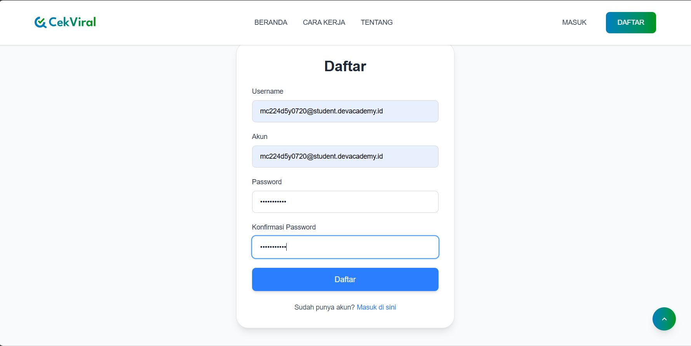
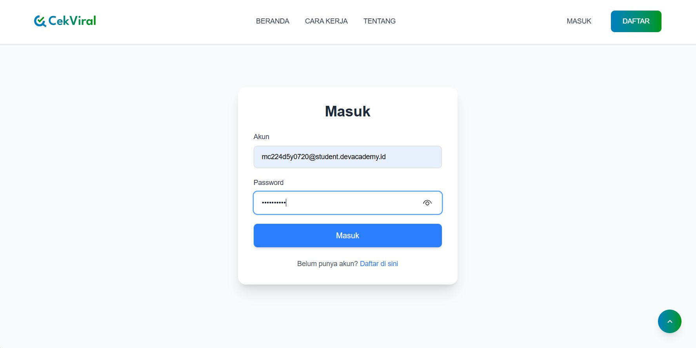
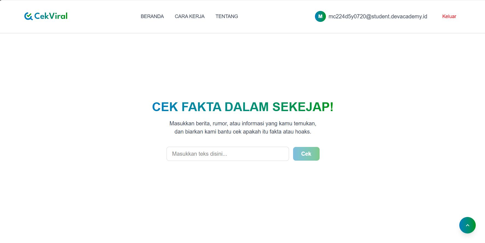
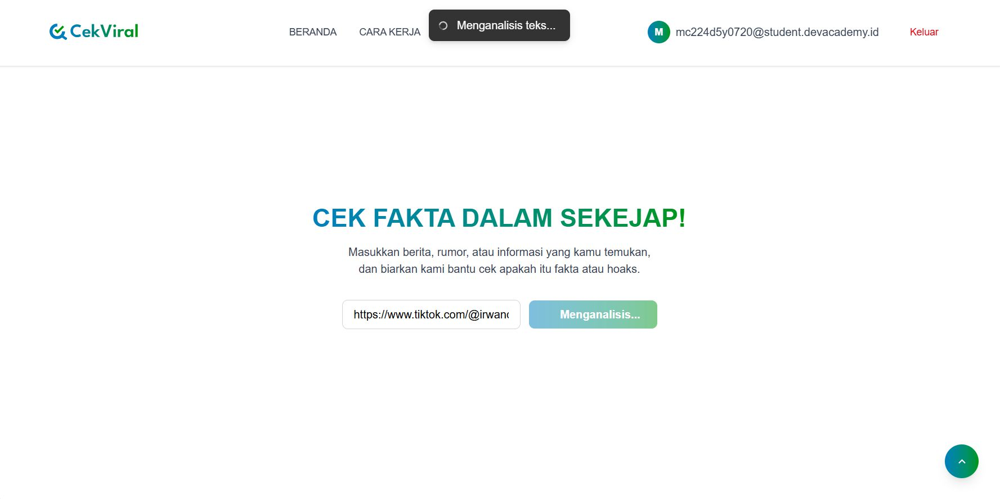
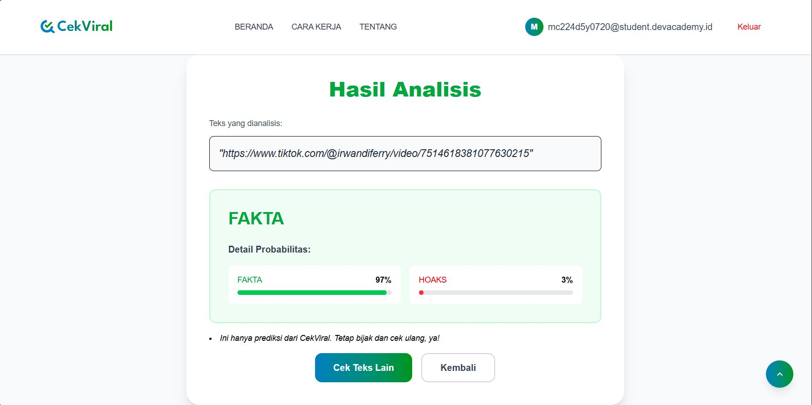

# Application Usage Guide CekViral: Smart Assistant for Viral Content Verification

Welcome to CekViral 👋

A smart web application that helps you verify the authenticity of viral content automatically, quickly, and accurately.

Have you ever come across a short video on social media 📺 or a news article on a website 📰 and wondered, “Is this really true?” Do you tend to trust the information right away or do you find yourself questioning how to check if it’s real or fake, especially when the content comes in different formats? 🧐

Don’t worry, that’s exactly what CekViral is here for. Whether it's video, link, or text, CekViral makes it easy for anyone to verify viral content fast and confidently 🤩

---
## 1. Access the CekViral Website
1. Open your browser (Chrome, Edge, Firefox, Safari, etc.).
2. Visit the official CekViral page: https://cek-viral-try.vercel.app/
---
## 2. Register a New Account
Before using the CekViral feature, you need to create an account first.
Steps:
1. Click the "DAFTAR" button.
2. Fill in the registration form with the following data:
    - Active email
    - Username
    - Password
3. Click the "Daftar" button.
4. If successful, you will be directed to the login page.
   

---
## 3. Login to Your Account
Steps:
1. Click the "MASUK" button.
2. Enter the email and password you registered.
3. Click the "Masuk" button to access the application.

---
## 4. Home Page
After logging in, you will enter the Home display. Here, you will see:
- Text input form or news link
- Button to verify

---
## 5. Main Features: Instant Verification (Check Instantly)
CekViral makes it easy for you to verify content in just a few seconds!
How to Use:
1. Enter text or news URL into the column provided.
2. Click the "Cek" button.
3. Wait a moment, the system will analyze the content automatically.

---
## 6. Verification Results
After the analysis is complete, you will see the prediction results:
- FACTS — Valid and trustworthy content.
- HOAX — Content is indicated as false or misleading.
- NOT YET VERIFIED — The system is not yet sure and requires further examination.

The results are displayed in the form of labels and probabilities (system confidence percentages) of the content.

---
## 🍿 Usage Tips 
1. Enter clear and complete text for more accurate analysis results.
2. Avoid inputting images/screenshots and only text or news links and videos from social media.
3. Use this feature as an initial aid, not a substitute for manual verification from official sources.
